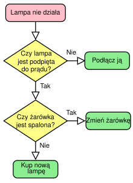
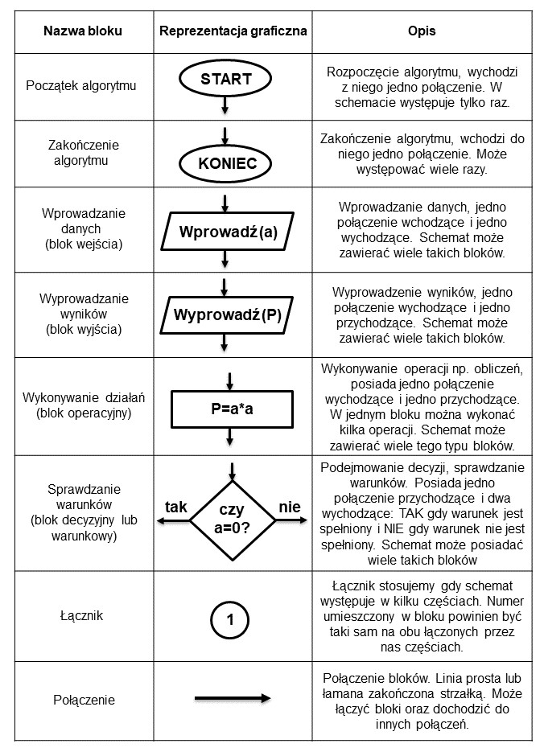
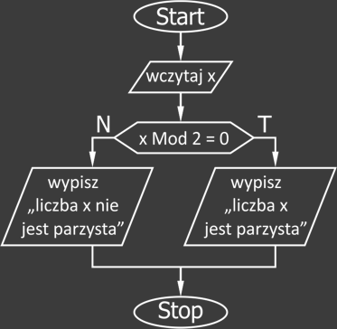

### **LAB1: Wstęp teoretyczny do budowania algorytmów z użyciem schematów blokowych**

#### **1. Co to jest algorytm?**
Algorytm to skończony, uporządkowany zbiór kroków, który prowadzi do rozwiązania określonego problemu. Powinien być:
- **Jednoznaczny** – każde działanie musi być precyzyjnie określone.
- **Skończony** – musi mieć określoną liczbę kroków i zakończyć się po pewnym czasie.
- **Poprawny** – powinien zwracać prawidłowe wyniki dla każdego poprawnego zestawu danych wejściowych.
- **Wydajny** – jego działanie powinno być możliwie jak najszybsze i zużywać jak najmniej zasobów.

#### **2. Jak można zapisać algorytm?**
Algorytm można przedstawić na kilka sposobów:
1. **Opis słowny** – np. "Weź dwie liczby, dodaj je do siebie i wypisz wynik."
2. **Lista kroków (pseudokod)** – użycie ustrukturyzowanego zapisu przypominającego kod.
```
wczytaj(a)
wczytaj(b)
Jeśli a > b to
	wypisz(a)
w przeciwnym razie
	wypisz(b)
```
3. **Schemat blokowy** – graficzna reprezentacja algorytmu w postaci bloków i strzałek.



#### **3. Podstawowe elementy schematu blokowego**
Schemat blokowy składa się z kilku podstawowych symboli:



#### **4. Przykład prostego algorytmu**
**Problem:** Napisz algorytm, który sprawdzi, czy dana liczba jest parzysta.

##### **Opis słowny:**
1. Pobierz liczbę od użytkownika.
2. Sprawdź, czy reszta z dzielenia przez 2 wynosi 0.
3. Jeśli tak – wypisz "Liczba jest parzysta".
4. W przeciwnym razie – wypisz "Liczba jest nieparzysta".

##### **Pseudokod:**
```
Początek
    Wpisz liczba
    Jeżeli liczba MOD 2 = 0 wtedy
        Wypisz "Liczba jest parzysta"
    W przeciwnym razie
        Wypisz "Liczba jest nieparzysta"
Koniec
```

##### **Schemat blokowy:**



#### **5. Zalety stosowania schematów blokowych**
- **Lepsza wizualizacja logiki algorytmu.**
- **Łatwiejsze wykrywanie błędów w algorytmie.**
- **Ułatwienie dokumentacji i pracy zespołowej.**
- **Możliwość szybszego przekładania schematu na kod.**

#### **Ćwiczenie**
Stwórz schemat blokowy, opis słowny oraz pseudokod dla algorytmu, który oblicza silnię liczby podanej przez użytkownika (n!).

