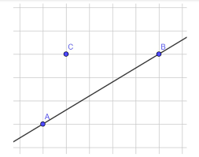
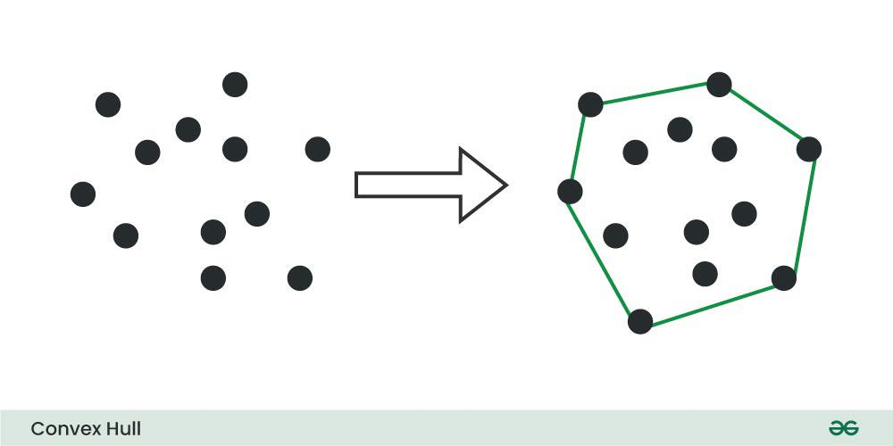
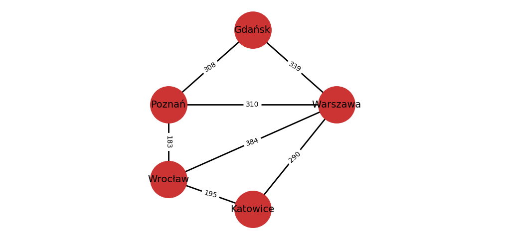
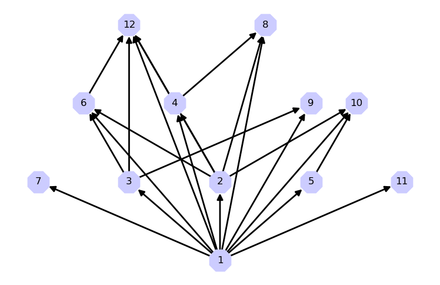
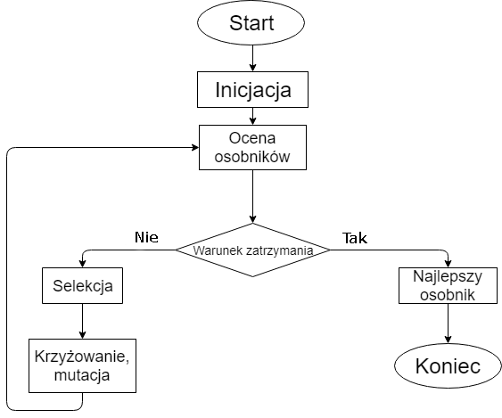

# Geometria obliczeniowa oraz teoria grafów

## 📚 **1. Wprowadzenie ogólne**

Dziedziny takie jak **geometria obliczeniowa**, **teoria grafów** i **algorytmy ewolucyjne** są filarami współczesnej informatyki. Znajdują zastosowanie m.in. w:

* robotyce (np. planowanie trasy robota),
* grafice komputerowej (np. modelowanie kształtów),
* systemach GIS (np. analiza przestrzenna),
* AI i optymalizacji (np. planowanie zadań, harmonogramowanie),
* biologii obliczeniowej (np. algorytmy genetyczne w bioinformatyce).
---

## 📐 **2. Geometria obliczeniowa**
Geometria obliczeniowa to dział informatyki zajmujący się projektowaniem i analizą algorytmów operujących na danych geometrycznych — takich jak punkty, odcinki, linie, wielokąty, koła czy wielościany.

Jest szczególnie istotna wszędzie tam, gdzie potrzebna jest analiza przestrzenna, w tym:
* w grafice komputerowej (rendering, modelowanie 3D),
* w systemach informacji geograficznej (GIS),
* w robotyce (planowanie ścieżek, widoczność),
* w CAD/CAM (projektowanie techniczne),
* w sztucznej inteligencji i grach (kolizje, mapowanie przestrzeni).


### 2.1 Współliniowość punktów

Trzy punkty w przestrzeni 2D są **współliniowe**, jeśli leżą na jednej prostej. Jest to fundamentalne pojęcie, wykorzystywane np. przy weryfikacji, czy dany punkt należy do odcinka lub czy zbiór punktów tworzy prostą.

**Sposoby sprawdzenia:**

* **Obliczenie pola trójkąta** – jeśli wynosi 0, punkty są współliniowe.
* **Sprawdzenie wyznacznika macierzy**:

  $$
  \begin{vmatrix}
  x_1 & y_1 & 1 \\
  x_2 & y_2 & 1 \\
  x_3 & y_3 & 1 \\
  \end{vmatrix} = 0
  $$




### 2.2 Otoczka wypukła (Convex Hull)

**Otoczka wypukła** to najmniejszy wielokąt wypukły, zawierający wszystkie punkty zbioru. Znalezienie jej ma znaczenie np. w:

* rozpoznawaniu kształtów,
* grach (np. detekcja kolizji),
* kompresji danych przestrzennych.

**Popularne algorytmy:**

* **Graham Scan** (złożoność: $O(n \log n)$) – sortuje względem kąta biegunowego.
* **Andrew’s Monotone Chain** – sortuje punkty po współrzędnych i buduje „dolną” i „górną” część otoczki.

**Własności otoczki:**

* Zawsze wypukła.
* Zawiera podzbiór punktów wejściowych – tzw. punkty ekstremalne.
* Może być używana jako preprocessing do innych algorytmów (np. triangulacji).



Źródło: [https://www.geeksforgeeks.org/](https://www.geeksforgeeks.org/convex-hull-algorithm/) [dostęp: 2025-05-09]

---

## 🕸️ **3. Teoria grafów i wybrane algorytmy grafowe**
### 🧭 3.1 Czym jest graf?

**Graf** to struktura matematyczna służąca do modelowania relacji między obiektami.

Składa się z:

* zbioru **wierzchołków (ang. vertices, nodes)**,
* zbioru **krawędzi (ang. edges, arcs)** – czyli połączeń między parami wierzchołków.

---

### 🧱 3.2 Podstawowe rodzaje grafów

| Typ grafu                       | Opis                                                             |
| ------------------------------- | ---------------------------------------------------------------- |
| **Graf nieskierowany**          | Krawędzie nie mają kierunku: $\{u, v\} = \{v, u\}$               |
| **Graf skierowany (digraf)**    | Krawędzie mają kierunek: $(u, v) \neq (v, u)$                    |
| **Graf ważony**                 | Każda krawędź ma przypisaną wagę (np. koszt, odległość)          |
| **Graf prosty**                 | Brak pętli i wielokrotnych krawędzi                              |
| **Graf spójny**                 | Istnieje ścieżka między każdą parą wierzchołków                  |
| **Graf cykliczny / acykliczny** | Zawiera lub nie zawiera cykli (np. DAG – Directed Acyclic Graph) |

#### Graf ważony:


Źródło: [https://math.uni.wroc.pl/](https://math.uni.wroc.pl/~jagiella/p2python/skrypt_html/wyklad7.html/) [dostęp: 2025-05-09]


#### Graf skierowany:


Źródło: [https://math.uni.wroc.pl/](https://math.uni.wroc.pl/~jagiella/p2python/skrypt_html/wyklad7.html/) [dostęp: 2025-05-09]

---

### 🔧3.3 Reprezentacja grafu w programowaniu

#### a) **Lista sąsiedztwa** (najczęściej używana)

```python
graph = {
    'A': ['B', 'C'],
    'B': ['D'],
    'C': ['D'],
    'D': []
}
```

#### b) **Macierz sąsiedztwa**

Macierz 0/1 lub z wagami, gdzie $A[i][j] = 1$ oznacza krawędź z $i$ do $j$.

---

### 🧮 3.4 Kluczowe pojęcia

* **Stopień wierzchołka** – liczba krawędzi wychodzących lub wchodzących.
* **Ścieżka** – ciąg wierzchołków połączonych krawędziami.
* **Cykl** – ścieżka, która zaczyna i kończy się w tym samym wierzchołku.
* **Drzewo** – graf spójny, acykliczny.
* **Drzewo rozpinające (MST)** – podzbiór krawędzi, który tworzy drzewo obejmujące wszystkie wierzchołki.

---

## ⚙️ **3.5 Klasyczne algorytmy grafowe**

### 3.5.1 Przeszukiwania grafu

#### 🔹 DFS – Depth-First Search

* Strategia „na głębokość” – idziemy maksymalnie w głąb, zanim zawrócimy.
* Używa **rekursji** lub **stosu**.
* Zastosowania: sortowanie topologiczne, wykrywanie cykli, komponenty spójności.

#### 🔹 BFS – Breadth-First Search

* Strategia „wszerz” – najpierw odwiedzamy sąsiadów, potem ich sąsiadów.
* Używa **kolejki**.
* Zastosowania: najkrótsza ścieżka w grafie **nieważonym**, poziomy drzewa.

---

### 3.5.2 Najkrótsze ścieżki

#### 🔹 Dijkstra

* Znajduje najkrótsze ścieżki z jednego wierzchołka do wszystkich innych w grafie z **nieujemnymi wagami**.
* Złożoność: $O((V + E) \log V)$ z kolejką priorytetową.

#### 🔹 Bellman-Ford

* Działa również dla **ujemnych wag**, ale wolniejszy.
* Potrafi wykryć cykle o **ujemnej długości**.

---

### 3.5.3 Minimalne drzewo rozpinające (MST)

#### 🔹 Kruskal

* Sortuje wszystkie krawędzie po wadze i wybiera je po kolei, unikając cykli (z użyciem struktury Union-Find).
* Dobry dla grafów rzadkich.

#### 🔹 Prim

* Buduje drzewo dodając najtańszą możliwą krawędź do rosnącego poddrzewa.
* Efektywny z kopcem (kolejką priorytetową).

---

### 3.5.4 Sortowanie topologiczne

* Dotyczy grafów **skierowanych acyklicznych (DAG)**.
* Układa wierzchołki w kolejności, w której każdy wierzchołek poprzedza wszystkie, do których prowadzą z niego krawędzie.

---

## 🌍 3.6 Praktyczne zastosowania grafów

| Dziedzina       | Zastosowanie grafów                                        |
| --------------- | ---------------------------------------------------------- |
| **Informatyka** | Algorytmy sieciowe, optymalizacja tras, analiza zależności |
| **AI / gry**    | Nawigacja agentów, mapy świata                             |
| **Biologia**    | Sieci metaboliczne, analiza genomu                         |
| **Internet**    | Struktura sieci, wyszukiwarki (PageRank)                   |
| **Logistyka**   | Planowanie transportu, optymalizacja ładunków              |

## 🧬 **4. Algorytm genetyczny (Genetic Algorithm, GA)**

### 4.1 Inspiracja biologiczna

Algorytmy genetyczne symulują procesy **ewolucji darwinowskiej**:

* Populacja osobników (rozwiązań).
* Przetrwają najlepiej przystosowani.
* W kolejnym pokoleniu powstaje nowa populacja – lepsza dzięki selekcji, krzyżowaniu i mutacji.

### 4.2 Elementy algorytmu:

1. **Kodowanie chromosomu** – najczęściej jako ciąg liczb, binarny lub rzeczywisty.
2. **Funkcja przystosowania (fitness)** – ocenia jakość rozwiązania.
3. **Selekcja** – np. ruletka, turniej.
4. **Krzyżowanie (crossover)** – tworzenie nowego potomstwa.
5. **Mutacja** – wprowadzenie losowej zmiany.
6. **Zakończenie** – np. po osiągnięciu liczby iteracji lub wartości docelowej.

### 4.3 Zastosowania GA:

* optymalizacja funkcji nieliniowych,
* harmonogramowanie zadań,
* planowanie tras (np. problem komiwojażera),
* sztuczna inteligencja (np. uczenie strategii gry).




Źródło: [https://home.agh.edu.pl/](https://home.agh.edu.pl/~zobmat/2018/wyr1/) [dostęp: 2025-05-09]

---

## 🎓 Podsumowanie

| Temat                  | Główne idee                     | Zastosowania                    |
| ---------------------- | ------------------------------- | ------------------------------- |
| Geometria obliczeniowa | Współliniowość, otoczka wypukła | GIS, grafika, robotyka          |
| Algorytmy grafowe      | DFS, BFS, Dijkstra, Kruskal     | Sieci, nawigacja, optymalizacja |
| Algorytm genetyczny    | Ewolucyjna optymalizacja        | AI, optymalizacja złożona       |

---

### Listy zadań
1. [Lista nr 7](../excercises/list07.md)
