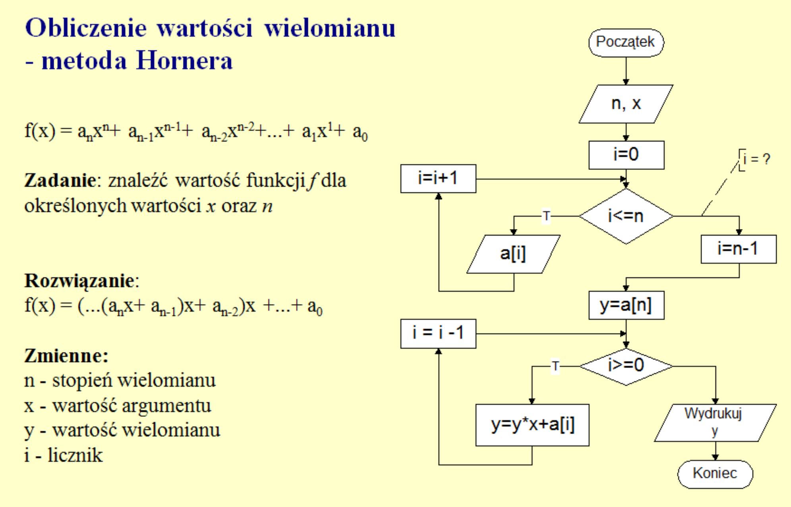
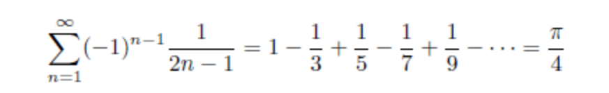
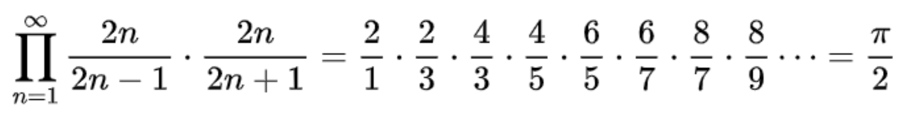

## Zadania laboratoryjne - lista nr 1

### Zadanie nr. 1
Stwórz schemat blokowy, opis słowny oraz pseudokod dla algorytmu, który oblicza silnię liczby podanej przez użytkownika (n!).

### Zadanie nr. 2

Napisz program do wyliczenia wartośći wielomianu metodą Hornera:

### Zadanie nr. 3

Obliczyć wartość liczby Pi metodą Leibniz’a

### Zadanie nr. 4

Obliczyć wartość liczby Pi za pomocą wzoru Wallisa:

### Zadanie nr. 5

Znajdź w internecie opis pojęcia liczb bliźniaczych. Napisz program do odnalezienia kilku
takich par w przedziale [1…1000].
