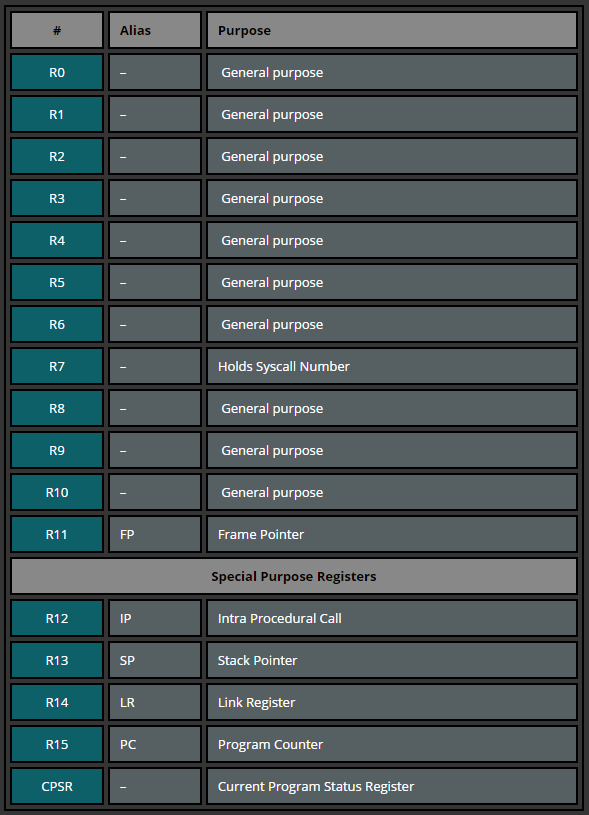

### **LAB: Wstęp do programowania w języku asembler**

#### **1. Wprowadzenie**

##### **1.1 Czym jest asembler?**

**Asembler (assembly)** to niskopoziomowy język programowania, w którym jedna instrukcja odpowiada zwykle pojedynczej operacji procesora. Kod napisany w asemblerze jest mocno zależny od architektury – oznacza to, że asembler ARM będzie inny niż asembler np. x86. Program napisany w asemblerze wymaga następnie assemblera (programu assembler) do zamiany tych instrukcji na odpowiadający im kod maszynowy (ciąg bitów rozumianych przez procesor). W odróżnieniu od języków wysokopoziomowych, asembler pozwala na bezpośrednią manipulację zasobami sprzętowymi, dając programiście pełną kontrolę nad rejestrami procesora i pamięcią, co przekłada się na możliwość znacznego zwiększenia wydajności programów​. Trzeba jednak pamiętać, że tak napisany kod bywa znacznie bardziej złożony i mniej wygodny w utrzymaniu niż kod w językach wyższego poziomu.

##### **1.2. Architektura ARM - podstawowe informacje**

**ARM (dawniej Acorn RISC Machine, obecnie Advanced RISC Machines)** to rodzina architektur procesorów o konstrukcji RISC (Reduced Instruction Set Computer). Procesory ARM cechują się prostym i jednolitym zestawem instrukcji (każda instrukcja ma stałą długość 32 bitów w trybie ARM) oraz dużą liczbą rejestrów roboczych. Typowy 32-bitowy procesor ARM (ARMv7) udostępnia 16 rejestrów ogólnego użytku nazwanych R0–R15​. Wśród nich wyróżniamy: R0–R12 jako rejestry ogólnego przeznaczenia do dowolnych obliczeń, R13 pełniący rolę wskaźnika stosu (Stack Pointer, SP), R14 pełniący rolę rejestru powrotu z podprogramu (Link Register, LR) oraz R15, który jest licznikiem rozkazów (Program Counter, PC) i wskazuje adres aktualnie wykonywanej lub następnej instrukcji​. Dodatkowo procesor posiada rejestr stanu CPSR (Current Program Status Register) zawierający m.in. flagi warunkowe: N (negatywny wynik), Z (zero), C (przeniesienie/pożyczka) i V (nadmiar). Flagi te są ustawiane przez niektóre instrukcje arytmetyczne i umożliwiają wykonywanie skoków warunkowych – będziemy z nich korzystać w bardziej zaawansowanych programach. ARM jest architekturą load/store – większość instrukcji arytmetycznych działa wyłącznie na danych znajdujących się w rejestrach, a dostęp do pamięci odbywa się osobnymi instrukcjami (ładowanie LDR i zapisywanie STR). Procesory ARM są szeroko stosowane w urządzeniach mobilnych, mikrokontrolerach i systemach wbudowanych ze względu na swoją energooszczędność i wysoką wydajność w przeliczeniu na wat mocy.

##### **1.3. Zalety nauki asemblera**

Programowanie w asemblerze uczy bardzo dokładnego zrozumienia działania procesora i programów na najniższym poziomie. Dzięki pisaniu kodu asemblerowego można dowiedzieć się, co tak naprawdę dzieje się wewnątrz CPU podczas wykonywania instrukcji – od zarządzania rejestrami, poprzez operacje arytmetyczne bit po bicie, aż po obsługę pamięci. Taka wiedza przekłada się na umiejętność efektywniejszego debugowania programów i zrozumienia błędów, które w językach wysokopoziomowych są ukryte przed programistą​ . Ponadto znajomość asemblera pozwala pisać krytyczne fragmenty kodu (np. obsługa sprzętu, optymalizacje) w sposób maksymalnie wydajny i dostosowany do danej architektury. Nawet jeśli na co dzień używamy języków wyższego poziomu, wiedza o tym, jak one przekładane są na instrukcje procesora, pomaga tworzyć lepszy kod (np. świadomie optymalizować pętle, unikać kosztownych operacji itp.). Reasumując, nauka asemblera rozwija programistę i otwiera drzwi do zagadnień niskopoziomowych, takich jak tworzenie systemów operacyjnych, sterowników urządzeń czy analiza bezpieczeństwa (eksploity, inżynieria wsteczna).

#### **2. Środowisko pracy**

Do uruchamiania i testowania kodu w asemblerze ARM będziemy korzystać z emulatora online [CPUlator](https://cpulator.01xz.net/?sys=arm)​. Jest to symulator komputera z procesorem ARM dostępny poprzez przeglądarkę WWW, który pozwala pisać kod, a następnie go kompilować (tłumaczyć na maszynowy) i wykonywać w środowisku wirtualnego procesora. Emulator ten udostępnia również podgląd działania programu – możemy krokowo debugować kod, obserwować wartości rejestrów, pamięć oraz urządzenia wejścia/wyjścia (symulowane diody, przyciski itp. w przypadku modelu układu deweloperskiego).

**Uruchomienie emulatora:** Aby rozpocząć pracę, otwórz w przeglądarce stronę emulatora pod adresem: [`cpulator.01xz.net/?sys=arm`](https://cpulator.01xz.net/?sys=arm) (symulacja podstawowego systemu ARMv7). Powinien ukazać się interfejs podzielony na kilka paneli. Kluczowe elementy to: panel edytora kodu (gdzie wpisujemy nasz program w asemblerze), panel rejestrów (wyświetla aktualne wartości R0–R15 i CPSR), panel z kodem maszynowym i dysasemblacją (podgląd wygenerowanych instrukcji) oraz panel pamięci. Poniżej znajduje się także konsola (która może służyć np. do wyświetlania tekstu, jeśli program tego wymaga, choć w przypadku prostych programów bez systemu operacyjnego zwykle nie jest używana).

**Konfiguracja i pierwszy program:** Domyślnie język w edytorze CPUlator powinien być ustawiony na ARMv7 Assembly. Upewnij się, że tak jest (opcję języka można znaleźć obok przycisku "Compile and Load"). Teraz możemy wpisać nasz pierwszy program. W panelu edytora wprowadź prosty kod, np.:

```asm
.text                   @ Sekcja kodu (tekstowa)
.global _start          @ Dyrektywa oznaczająca punkt wejścia programu
_start:                 @ Etykieta startowa programu
    MOV R0, #5          @ Załóżmy R0 = 5
    MOV R1, #3          @ Załóżmy R1 = 3
    ADD R2, R0, R1      @ R2 = R0 + R1 (dodajemy 5 + 3, wynik 8 w R2)
    MOV R7, #1          @ Kod wywołania systemowego 1 (exit) w R7
    MOV R0, #0          @ Kod zakończenia 0 (sukces) w R0
    SVC 0               @ Wywołaj przerwanie programowe (syscall exit)

```

Powyższy kod to minimalny program dodający dwie liczby. Sekcja .text i dyrektywa .global _start informują assembler, że zaczyna się sekcja kodu wykonywalnego, a etykieta _start będzie punktem startowym programu (adres, od którego procesor zacznie wykonanie). Następnie ustawiamy w rejestrach R0 i R1 przykładowe wartości (5 i 3). Instrukcja ADD R2, R0, R1 dodaje te dwie liczby – procesor pobiera zawartości R0 i R1, dodaje je i wynik umieszcza w R2. Końcowe trzy linie to wywołanie sygnału zakończenia programu – w kontekście emulatora CPUlator oznacza to zakończenie symulacji. Ustawiamy w R7 numer wywołania systemowego exit (1) oraz w R0 kod wyjścia 0, po czym wykonujemy instrukcję SVC 0 (Supervisor Call), która powoduje wywołanie przerwania programowego obsługującego zakończenie programu. Dzięki temu emulator wie, że program się skończył (inaczej procesor próbowałby wykonywać kolejne bajty, które nie są naszym programem).

**Kompilacja i uruchomienie:** Gdy kod jest gotowy, kliknij przycisk **Compile and Load (F5)**. Emulator prześle Twój kod na serwer, gdzie zostanie on skompilowany do postaci maszynowej i załadowany do wirtualnej pamięci procesora. Jeśli w kodzie wystąpiły błędy składni, pojawią się komunikaty – w takim wypadku popraw je i ponownie skompiluj. Jeśli kompilacja się powiodła, możesz uruchomić program. W tym celu naciśnij **Continue (Shift+F2)** – spowoduje to wykonanie programu z normalną prędkością do końca (lub do punktu przerwania, jeśli takowy ustawimy). Alternatywnie, możesz użyć przycisków **Step Into (F2)** lub **Step Over (Ctrl+F2)**, aby wykonywać kod krokowo, instrukcja po instrukcji. Po uruchomieniu programu obserwuj panel rejestrów – powinny w nim pojawić się zmienione wartości zgodne z działaniem instrukcji. Dla naszego przykładu po wykonaniu `ADD R2, R0, R1` wartość R2 powinna zmienić się na 8 (0x00000008 w notacji szesnastkowej), co będzie widoczne w spisie rejestrów. Po wykonaniu `SVC 0` symulacja zostanie zatrzymana (stan Stopped), co oznacza zakończenie programu.

**Resetowanie i modyfikacja:** Możesz teraz modyfikować kod (np. zmienić wartości lub instrukcje) i ponownie go uruchamiać. Przycisk **Restart (F4)** resetuje procesor do stanu początkowego (ustawia PC na początek programu) bez ponownej kompilacji, co jest przydatne, gdy chcesz wykonać ponownie ten sam załadowany już program. Gdy zmienisz kod, ponownie użyj **Compile and Load**, aby zaktualizować program w pamięci symulatora. W razie potrzeby możesz też skorzystać z menu **Help** w emulatorze, gdzie dostępne są przykładowe programy i dokumentacja opisująca różne funkcje CPUlator.

#### **4. Podstawowe elementy języka ARM**

**Rejestry procesora.** Jak wspomniano, w trybie podstawowym ARM ma 16 rejestrów 32-bitowych oznaczonych od R0 do R15. Większość z nich to rejestry ogólnego użytku, wykorzystywane do przechowywania danych i adresów podczas wykonywania programu. Kilka rejestrów ma specjalne przeznaczenie: R13 jest zwyczajowo używany jako wskaźnik stosu (SP), R14 jako rejestr link (LR) do przechowywania adresu powrotu przy wywołaniach podprogramów, a R15 to licznik rozkazów (PC), który zawsze wskazuje bieżącą lub następną instrukcję​. Warto pamiętać, że zapisy do R15 wpływają na przepływ programu (zmiana PC powoduje skok). Każdy rejestr ma pojemność 32 bitów (4 bajty) i może przechować zarówno dane (liczby całkowite, adresy pamięci, itp.), jak i kod maszynowy (w przypadku PC). Poniżej przedstawiono zestaw rejestrów ARM:



W asemblerze odwołujemy się do rejestrów poprzez ich nazwy (R0, R1, ..., R15). Należy zauważyć, że **programista sam musi zadbać o właściwe wykorzystanie rejestrów** – np. jeśli wykonamy kolejne operacje, które nadpisują dany rejestr, poprzednia zawartość zostanie utracona. Dlatego często stosuje się konwencje (tzw. konwencja wywołania), które określają, które rejestry należy zachować pomiędzy wywołaniami funkcji, a które mogą być nadpisywane. Na poziomie naszego prostego programu możemy jednak swobodnie używać rejestrów R0–R12. Warto też pamiętać, że w architekturze ARM wszystkie operacje arytmetyczne i logiczne odbywają się na zawartości rejestrów – jeśli chcemy wykonać operację na danych w pamięci, najpierw musimy załadować je do rejestru.

**Podstawowe instrukcje.** Asembler ARM posługuje się mnemonikami – krótkimi nazwami opisującymi operacje. Każda instrukcja asemblera zazwyczaj odpowiada jednej instrukcji maszynowej procesora. Format typowej instrukcji to: MNEMONIK <docelowy>, <operand1>, <operand2>. Większość instrukcji wymaga podania docelowego rejestru oraz źródła danych (które może być rejestrem lub wartością natychmiastową). Oto kilka podstawowych instrukcji ARM i ich działanie:

- **MOV** – (Move) kopiuje wartość do rejestru. Może służyć do załadowania wartości stałej (tzw. immediate) do rejestru lub skopiowania zawartości jednego rejestru do innego. Np. `MOV R0, #10` ustawia rejestr R0 na wartość 10, a `MOV R1, R0` skopiuje wartość z R0 do R1 (po tej operacji R1 będzie mieć tę samą zawartość co R0).
- **ADD** – (Add) dodaje dwie liczby. Składnia to np. `ADD Rd, Rn, Rm`, co oznacza: Dodaj zawartość rejestru Rn i Rm, a wynik zapisz do rejestru Rd. Przykład: `ADD R2, R0, R1` spowoduje obliczenie sumy R0 + R1 i zapisanie wyniku w R2​. Można także dodawać wartość stałą: np. `ADD R3, R3, #1`zwiększy zawartość R3 o 1 (inkrementacja).
- **SUB** – (Subtract) odejmuje dwie liczby. Składnia analogiczna do ADD: `SUB Rd, Rn, Rm` wykonuje Rd = Rn – Rm. Przykład: `SUB R4, R0, R1` od wartości w R0 odejmie wartość w R1 i wynik umieści w R4. Odejmowanie wartości stałej wygląda np. tak: `SUB R1, R1, #5` (zmniejszenie R1 o 5).

W powyższych instrukcjach `#liczba` oznacza wartość natychmiastową (literally wstawiana do instrukcji), a nazwy rejestrów bez krzyżyka odnoszą się do aktualnej zawartości tych rejestrów. Warto zauważyć, że instrukcje **nie rozróżniają typów danych** – procesor po prostu traktuje 32-bitową zawartość rejestru jako liczbę binarną. To od programisty zależy interpretacja (np. czy dana wartość to liczba bez znaku, ze znakiem, adres, itp.). Większość instrukcji arytmetycznych domyślnie nie wpływa na flagi warunkowe, chyba że użyjemy wariantu z dopisaną literą „S” (np. ADDS zamiast ADD). Istnieją także instrukcje specjalnie do porównywania (CMP), które ustawiają tylko flagi, nie zapisując wyniku – jednak to zagadnienie omówimy przy sterowaniu wykonaniem programu (skoki warunkowe).

Składnia i konwencje zapisu. Asembler ARM (w szczególności składnia GNU as) dopuszcza pewną elastyczność w zapisie, ale warto trzymać się konwencji ułatwiających czytelność kodu:

- Każda instrukcja znajduje się w osobnej linii. Najpierw podajemy mnemonik, a po nim argumenty oddzielone przecinkami. Mnemoniki zwykle pisze się wielkimi literami (choć nie jest to obowiązkowe).
- Możemy definiować etykiety (label) – są to nazwy zakończone dwukropkiem `:` na początku linijki, które oznaczają pewne adresy w kodzie. Służą one jako punkty docelowe skoków lub jako nazwy danych. Np. `_start:` jest etykietą początku programu, a w dalszej części możemy mieć etykiety np. `loop:` do oznaczenia początku pętli.
- Linie zaczynające się od średnika `;` lub znaku `@` (małpa) to komentarze. W przypadku asemblera ARM przyjęło się używać znaku `@` do komentarzy jednowierszowych – wszystko co znajduje się po `@`zostanie zignorowane przez assembler. Komentarze służą do opisywania działania kodu i zdecydowanie warto z nich korzystać, aby ułatwić sobie i innym zrozumienie programu.
- Dyrektywy assemblera (pseudo-instrukcje, które nie przekładają się bezpośrednio na kod maszynowy, ale wpływają na proces kompilacji) zaczynają się od kropki. Przykłady z naszego kodu to `.text` (oznacza początek sekcji kodu wykonywalnego) oraz .`global _start` (oznacza, że etykieta `_start` ma być widoczna globalnie – potrzebne, aby program mógł się prawidłowo uruchomić od tej etykiety). Dyrektywy te nie są instrukcjami procesora, ale informują assembler/linker jak zorganizować kod w pamięci.

Znając powyższe podstawy, spróbujmy przeanalizować przykładowe programy napisane w asemblerze ARM. Pokażą one, jak wykorzystać instrukcje i rejestry do wykonania prostych operacji arytmetycznych.

#### **5. Przykłady kodu**

Poniżej przedstawiono dwa przykłady programów w asemblerze ARM wraz z omówieniem ich działania krok po kroku. Każdy z nich można skopiować do emulatora CPUlator i uruchomić, aby prześledzić jego działanie w praktyce. Komentarze w kodzie (po znakach `@`) objaśniają logikę działania poszczególnych instrukcji.

Przykład 1: Dodawanie dwóch liczb
Ten program dodaje do siebie dwie liczby i kończy działanie. Pokazuje to zastosowanie instrukcji `MOV` i `ADD`.

```asm
.text
.global _start
_start:
    MOV R0, #10       @ Wpisz do R0 wartość 10
    MOV R1, #7        @ Wpisz do R1 wartość 7
    ADD R2, R0, R1    @ R2 = R0 + R1 (10 + 7 = 17)
    MOV R7, #1        @ Przygotuj wywołanie sys_exit (1)
    MOV R0, #0        @ Kod zakończenia 0
    SVC 0             @ Zakończ program (syscall exit)
```

Omówienie: Najpierw ustawiamy dwie liczby: 10 w rejestrze R0 oraz 7 w rejestrze R1. Następnie instrukcja `ADD R2, R0, R1` sumuje te dwie wartości – procesor pobiera 10 z R0 i 7 z R1, dodaje je, a wynik (17) umieszcza w R2. W tym momencie w rejestrze R2 powinniśmy otrzymać wartość 17 (0x00000011 w hex). Zauważ, że rejestry R0 i R1 zachowują swoje oryginalne wartości (10 i 7) – instrukcja ADD ich nie zmienia, bo wynik został zapisany do R2. Gdybyśmy chcieli, mogliśmy zapisać wynik z powrotem do R0 (`ADD R0, R0, R1`), ale wtedy utracilibyśmy pierwotną wartość R0. W ostatnich trzech liniach wykonujemy wywołanie systemowe zakończenia programu (tak samo jak w poprzednim przykładzie w sekcji Środowisko pracy), aby zamknąć poprawnie aplikację. Po uruchomieniu tego programu na emulatorze powinniśmy zobaczyć w panelu rejestrów, że R2 ma wartość 17, co jest spodziewanym wynikiem dodawania 10 + 7.

Przykład 2: Operacje arytmetyczne – sumowanie i odejmowanie
Drugi program wykonuje nieco bardziej złożone działanie: oblicza wyrażenie (a + b) – c. Wykorzystamy w nim zarówno dodawanie, jak i odejmowanie.

```asm
.text
.global _start
_start:
    MOV R0, #8        @ a = 8
    MOV R1, #3        @ b = 3
    MOV R2, #4        @ c = 4
    ADD R3, R0, R1    @ R3 = a + b = 8 + 3 = 11
    SUB R4, R3, R2    @ R4 = R3 - c = 11 - 4 = 7
    MOV R7, #1        @ Kod przerwania (exit)
    MOV R0, #0        @ Kod zakończenia 0
    SVC 0             @ Zakończ program
```

Omówienie: W rejestrach R0, R1, R2 umieszczamy kolejno wartości a, b i c (dla przykładu 8, 3, 4). Następnie `ADD R3, R0, R1` oblicza sumę a + b i zapisuje ją do R3. W naszych liczbach: R3 powinno otrzymać wartość 11. Kolejna instrukcja `SUB R4, R3, R2` oblicza R3 - c, czyli 11 - 4, a wynik (7) zapisuje do R4. W rezultacie w R4 powinna znaleźć się ostateczna wartość wyrażenia (a+b)-c. Rejestry R0, R1, R2 zachowują swoje pierwotne liczby, a R3 przechowuje wartość pośrednią (a+b). Zauważ, że równie dobrze mogliśmy wykonać odejmowanie w R3 (np. S`UB R3, R3, R2` zamiast do R4), wtedy wynik końcowy znalazłby się w R3 nadpisując wartość sumy – takie rozwiązanie jest bardziej oszczędne w rejestry, ale mniej czytelne dla celów dydaktycznych. Ostatnie trzy linie ponownie wykonują syscall zakończenia programu. Po uruchomieniu tego kodu w emulatorze zobaczymy, że R4 ma wartość 7 (wynik działania), R3 = 11 (suma pośrednia), a R0, R1, R2 nadal 8, 3, 4 odpowiednio.

Oba powyższe przykłady ilustrują kluczowe elementy programowania w asemblerze ARM: wykorzystanie rejestrów do przechowywania danych oraz podstawowe instrukcje arytmetyczne do przetwarzania tych danych. Warto poeksperymentować z tymi przykładami – np. zmienić wartości liczb lub zamienić kolejność operacji – aby zaobserwować, jak wpływa to na wyniki w rejestrach.

### Listy zadań
1. [Lista nr 1](../exercises/list01.md))